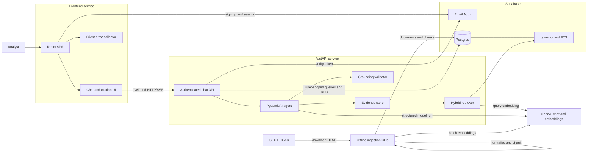
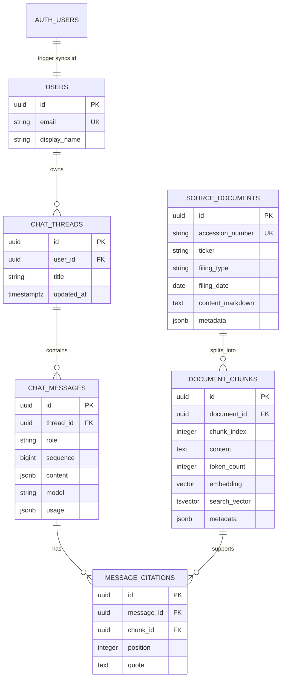
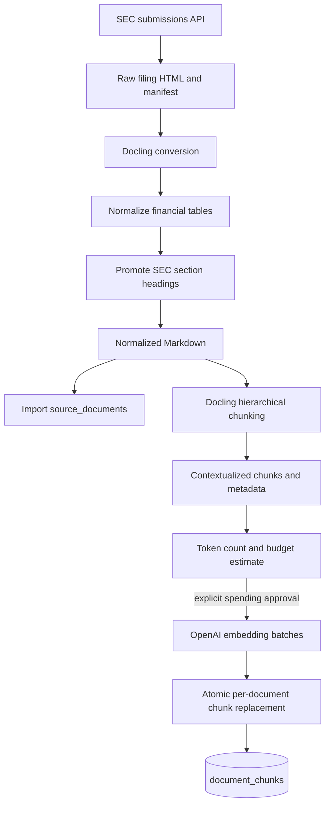
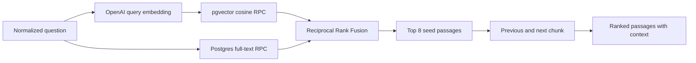
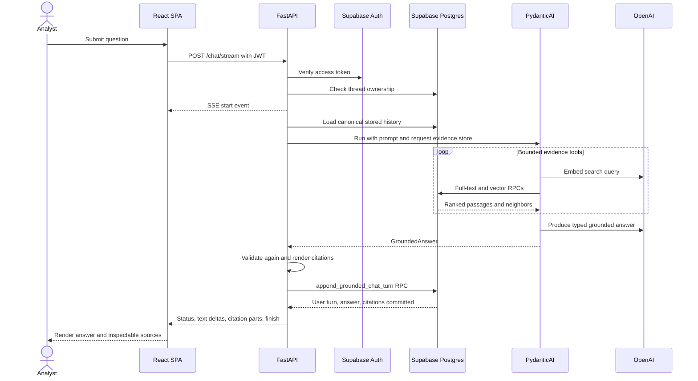

# Document Copilot technical guide

This document describes the system that is implemented in this repository. It
is intended for engineers extending the ingestion, retrieval, grounding, chat,
or deployment layers. For installation and day-to-day commands, start with the
[root README](../README.md).

## Design goals

Document Copilot is designed around a narrow trust contract:

1. Search only the curated filing corpus.
2. Show the model a bounded, request-scoped evidence set.
3. Require structured statements and exact source quotes.
4. Reject output that cites unseen or altered evidence.
5. Persist the user turn, grounded answer, and citations together.

The application is an evidence assistant, not a general market-data tool or an
investment recommendation system.

## System architecture



### Component responsibilities

| Component | Responsibility |
| --- | --- |
| React SPA | Session-aware routes, thread UI, SSE chat state, citation/source panel, safe user errors |
| FastAPI | Authorization, orchestration, failure boundaries, streaming protocol, persistence |
| Supabase Auth | Email identity and browser sessions |
| Supabase Postgres | RLS-protected chats, normalized documents, chunks, indexes, RPC functions |
| PydanticAI agent | Bounded tool use and typed `GroundedAnswer` production |
| OpenAI | Query/document embeddings and structured answer generation |
| Ingestion CLIs | Reproducible HTML conversion, chunking, embedding, and database import |

## Runtime modules

Backend request-path code is organized as follows:

- `app/api/chat.py`: thread endpoints and the chat SSE endpoint.
- `app/auth/dependencies.py`: Supabase bearer-token verification and user client.
- `app/chat/orchestrator.py`: one complete model turn.
- `app/assistant/`: model, tools, typed dependencies, and output contract.
- `app/retrieval/`: database RPC calls, RRF, and neighbor expansion.
- `app/grounding/`: fail-closed validation and deterministic rendering.
- `app/database/chats.py`: user-scoped chat persistence helpers.
- `app/observability.py`: structured logs and public error references.

Frontend runtime code is organized as follows:

- `src/Router.tsx`: public auth routes and protected chat routes.
- `src/lib/supabase.ts`: the browser auth client.
- `src/lib/http.ts` and `src/lib/api.ts`: typed JSON requests with bearer tokens.
- `src/lib/chatTransport.ts`: chat-specific fetch errors and auth recovery.
- `src/lib/chat.ts`: AI SDK message and data-part types.
- `src/components/chat/`: message, citation, source, error, and thread UI.
- `server/clientLogPlugin.ts`: same-origin Vite middleware for client error logs.

## Configuration and trust boundaries

Backend settings are loaded and validated at import time by
`backend/app/config.py`. Frontend settings are validated during bundle startup by
`frontend/src/lib/env.ts`. No application module should read environment values
directly.

The browser receives only:

- `VITE_API_BASE_URL`
- `VITE_SUPABASE_URL`
- `VITE_SUPABASE_ANON_KEY`

The backend alone receives the service-role key, direct database URL, and
OpenAI key. Normal API database operations use an anon-key Supabase client with
the user's bearer token so Postgres RLS evaluates `auth.uid()`. The current
thread-ownership check uses a service-role client only to distinguish a missing
thread (`404`) from another user's thread (`403`); this privileged request-path
lookup is called out for simplification in the
[project review](project-review.md).

Supabase Auth users are copied into `public.users` by the trigger introduced in
migration `20260824_06`. This makes the public user row available for the chat
thread foreign key without client-side profile bootstrapping.

## Data model



Important database invariants:

- `(document_id, chunk_index)` and `(thread_id, sequence)` are unique.
- Embeddings are exactly 1,536 dimensions.
- `search_vector` is a generated English `tsvector` over chunk content.
- HNSW indexes cosine vector distance; GIN indexes full-text search.
- Authenticated users can read the shared document corpus.
- Users can read and mutate only their own threads, messages, and citations.
- Citations cannot outlive or replace their referenced chunk silently.

Alembic is the schema source of truth. The migrations also own Postgres RPC
functions, grants, RLS policies, and the Auth synchronization trigger.

## Ingestion pipeline



### Filing download

`data/download.py` queries SEC submissions metadata with an identifying user
agent, downloads a configured number of 10-K filings, and writes a manifest with
accession numbers, dates, report years, source URLs, and local paths. Raw files
and the generated manifest live under the ignored `data/downloads/` directory.

### Table normalization

SEC financial tables often encode visual spacing as large grids and split
symbols such as `$`, `(`, `)`, and `%` into separate cells. The converter:

1. Removes empty layout cells and collapses whitespace.
2. Merges adjacent financial prefixes and suffixes with their values.
3. Selects the row with the most cells, then the most numeric cells, as the
   representative logical column layout.
4. Assigns every source cell to the logical column with the largest span
   overlap; midpoint distance breaks a no-overlap case.
5. Emits compact semantic Markdown tables and preserves rich cell content.
6. Promotes `PART`, `ITEM`, and short uppercase section labels to headings.

This is deterministic and unit-tested because malformed financial tables would
degrade both chunking and citation quality.

### Hierarchical chunking

Docling's `HierarchicalChunker(merge_list_items=True)` groups content by document
structure. Each chunk is contextualized with its headings before embedding.
The importer records:

- stable position within the document;
- section and all heading labels;
- first page and complete page set;
- Docling item references;
- ticker, form, report year, and accession number;
- token count and the `docling_hierarchical` strategy label.

Any chunk over the 8,192-token embedding input limit fails before an API call.

### Idempotency and spending controls

`source_documents` is upserted by accession number and stores a SHA-256 hash of
the normalized Markdown. A document's chunks are current only when their count,
positions, content hash, and embedding model match. Current documents are
skipped.

Embedding import has a separate estimate mode. The paid mode requires both a
maximum total-token budget and the account token-per-minute limit. Chunks are
greedily grouped into requests under the configured token budget; requests are
paced from the prior request's token count. A document's old chunks are deleted
and its new embedded chunks inserted in one database transaction.

## Hybrid retrieval algorithm

The retriever returns eight passages by default from two candidate rankings of
up to 30 passages each.



Query embedding and lexical search start concurrently. Semantic search begins
as soon as the embedding is available.

### Semantic ranking

Postgres orders chunks by cosine distance using:

```text
embedding <=> query_embedding
```

The returned diagnostic score is `1 - cosine_distance`. Optional ticker,
report-year, and filing-type filters are applied inside the RPC.

### Lexical ranking

Question terms are joined with `OR` for broad recall and parsed with
`websearch_to_tsquery('english', ...)`. Matching chunks are ranked by
`ts_rank_cd`; the generated `search_vector` is served by a GIN index.

### Reciprocal Rank Fusion

Raw vector and text scores are not comparable. RRF uses rank position instead:

```text
RRF(d) = w_semantic / (k + rank_semantic(d))
       + w_lexical  / (k + rank_lexical(d))
```

The current values are `k = 60` and both weights are `1`. A chunk absent
from one ranking contributes zero for that term. Results sort by descending RRF
score, then best available source rank, then chunk UUID for deterministic ties.
Duplicate chunk IDs within one source ranking count only once.

### Neighbor expansion

After fusion, one preceding and one following chunk from the same source
document are loaded for each seed where available. Neighbor text does not alter
the RRF score. It is registered as context that the agent may explicitly read.

## Evidence tools and budgets

Each assistant run receives a new `EvidenceStore`; evidence never crosses
requests. The agent has three sequential tools:

1. `search_filings`: hybrid search with optional ticker/year/form filters.
2. `read_chunk`: full content for a chunk returned by a prior search.
3. `read_surrounding_chunks`: neighbors attached to a prior search result.

The evidence store caches identical searches and limits a run to six distinct
searches and 40 exposed passages. Search results longer than 4,000 characters
are excerpted around the first query term of at least four characters. A full
chunk or neighbor becomes citable only after the corresponding read tool exposes
it.

The agent run is also bounded to 10 model requests, 12 tool calls, 120,000 total
tokens, and 10,000 output tokens. The OpenAI model request itself caps output at
5,000 tokens and disables parallel tool calls.

## Chat request lifecycle



The request body uses AI SDK UI messages, but only the latest user text is the
new prompt. The backend reloads prior history from its own database rather than
trusting browser-supplied history.

The SSE connection opens and sends a start event immediately. The structured
model run and atomic persistence finish before answer text is emitted as word
deltas. This is buffered answer delivery, not token-by-token model streaming;
the latency tradeoff is tracked in the [project review](project-review.md).

## Grounding algorithm

The model must return one of three typed states:

- `answered`: one to 20 statements, each with one to eight citations;
- `insufficient_evidence`: no statements and an explanatory message;
- `refused`: no statements and a refusal message.

For an answered statement, each citation contains a chunk UUID and a contiguous
quote. Validation proceeds as follows:

```text
for every statement:
    require at least one citation through the output schema
    for every citation:
        require chunk_id in the current run's exposed evidence
        normalize whitespace in quote and exposed passage
        require the non-empty quote to be an exact substring
```

An `insufficient_evidence` result is valid only after at least one corpus search.
A refusal needs no search. The PydanticAI output validator can ask the model to
retry invalid output twice. The orchestrator then runs the same validation again
independently before any response or database write.

Rendering is deterministic. It appends `[n]` markers to statements, deduplicates
citations by `(chunk_id, exact_quote)`, and obtains filing metadata from the
trusted retrieved passage rather than model output.

## Atomic chat persistence

The `append_grounded_chat_turn` Postgres function runs as the authenticated user
and locks the target thread. It:

1. Confirms `auth.uid()` owns the thread.
2. Computes the next sequence while the thread lock prevents competing turns
   from choosing the same position.
3. Inserts the user message and assistant message.
4. Inserts normalized citations linked to the assistant message.
5. Updates the thread timestamp.

Any failure rolls back the entire RPC. The UI can therefore recover by reloading
history without finding an assistant answer whose citations were only partly
saved.

## Streaming wire contract

Successful `/chat/stream` responses use `text/event-stream` and the AI SDK
`x-vercel-ai-ui-message-stream: v1` marker. Event order is:

1. `start`
2. `data-answer-status`
3. `text-start`
4. one or more `text-delta`
5. `text-end`
6. zero or more `data-citation`
7. `finish`
8. `[DONE]`

Answer status and citations are stored inside the assistant message so they
survive reload. Stream failures send a transient `data-chat-error`, a safe error
event, and `[DONE]`. The error categories are retrieval, grounding, assistant,
and persistence failure; exception details stay in backend logs.

## Observability

Both services produce newline-delimited JSON and a short reference safe to show
to the user:

- backend: `be-...` in `backend/logs/backend.log`;
- frontend: `fe-...` in `frontend/logs/frontend.log`.

Files rotate at 5 MB with five backups, and the same structured entries are
written to service output. Browser reports include error metadata, route,
operation, browser user agent, and linked backend reference. They intentionally
exclude chat text, credentials, access tokens, and API response bodies.

## Verification strategy

The fast backend suite mocks external boundaries and covers auth, API behavior,
chat conversion, orchestration, database helpers, ingestion, retrieval, RRF,
grounding, rendering, configuration, and logging. The marked integration test
and evaluation scripts require live services.

Retrieval evaluation runs 10 cases derived from the client brief and reports the
top passages. Grounding evaluation covers supported answers, comparisons,
evidence-aware uncertainty, and investment-advice refusal with an explicit
paid-call flag.

The frontend intentionally has no test runner. Its required automated checks are
strict TypeScript compilation through `pnpm build` and ESLint, followed by the
manual auth/chat/citation acceptance path described in the root README and
contribution guide.
